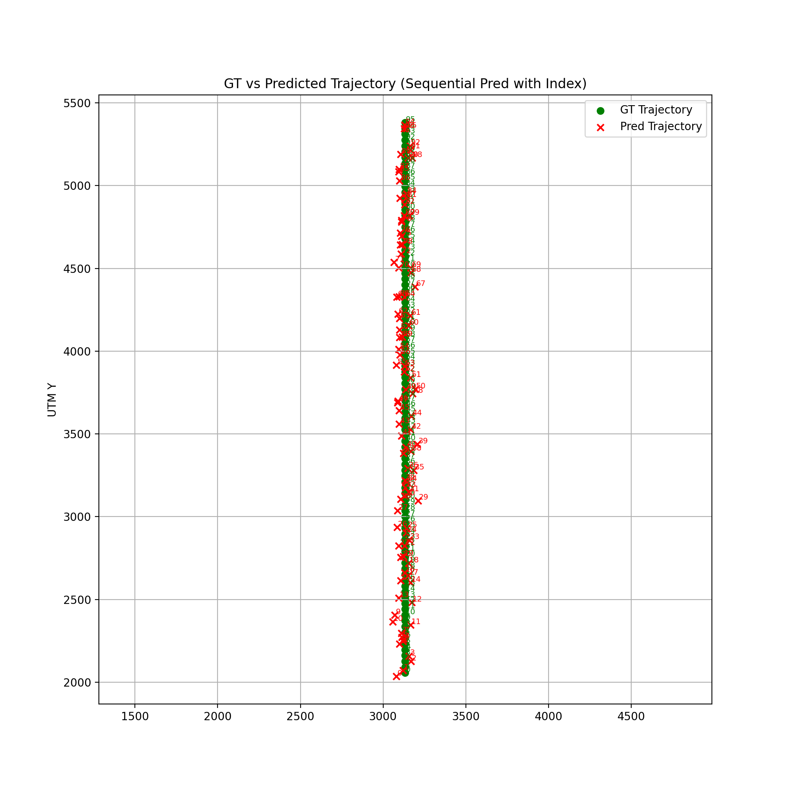

# 🚧 STHN-TrajExtension
> This project is **still under modification and not finalized yet.**

---

## 📖 Reference
This work is an extension of the **STHN model** proposed in:  
- **Paper**: *STHN: Satellite-Thermal Homography Network for UAV-Thermal Localization*  
- **Official GitHub**: [https://github.com/arplaboratory/STHN](https://github.com/arplaboratory/STHN)  

MIT License applies as in the original repository.  
All credit for the base model and dataset preparation goes to the original authors (ARPL).  

---

## 🇰🇷 한글 요약
이 프로젝트는 **STHN 모델**을 기반으로, 직접 멀티라인 trajectory 데이터를 **단일 trajectory**로 단순화하여 재가공 후,  
local matching 성능과 좌표 오차를 평가한 확장 연구 코드입니다.  

---

## 📌 Overview
This repository contains my extension work based on the **STHN model**.  
The main idea is to process the original STHN dataset to create a **single-line trajectory dataset**,  
then evaluate how well the pretrained STHN performs **local matching** on this simplified data.  

### Key points
- Dataset preprocessing (multi-line → single-line trajectory)  
- Local matching with pretrained STHN  
- Evaluation of coordinate errors vs. ground truth  
- Trajectory visualization  

---

## 📂 Structure


---


---

## 📊 Results



### Example Outputs
```python
import glob
from IPython.display import Image, display

for img_path in glob.glob("results/*.png"):
    display(Image(filename=img_path))
